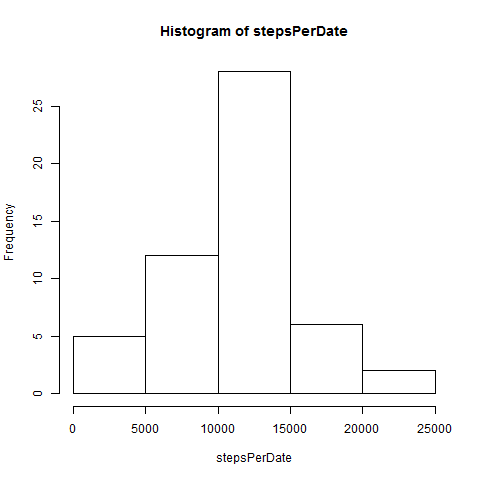
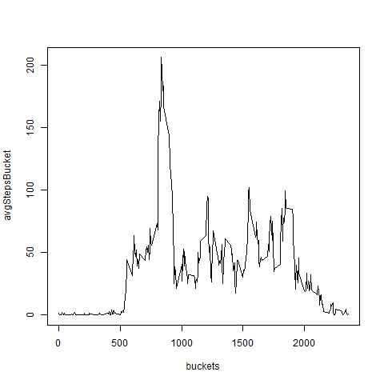
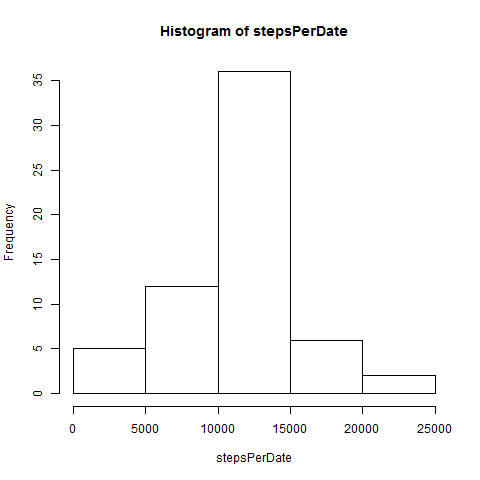
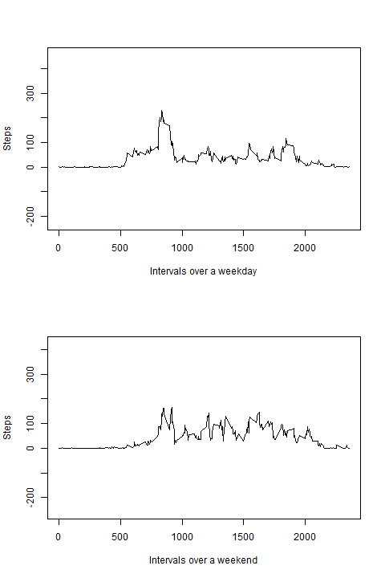

This section relates to loading the raw data.
``` {r, echo=TRUE}
data <- read.csv("activity.csv",stringsAsFactors=FALSE,na.strings="NA")
data2 <- na.omit(data) ##Data with NA's removed

if(!file.exists("figures")) { dir.create("figures") }

stepsPerDate <- rowsum(data2$steps,group=data2$date)
dates <- row.names(stepsPerDate)
```

This plots the first histogram.
```{r, echo=TRUE, results="hide"}
png("figures\\hist1.png") ## Save image in PNG format
hist(stepsPerDate)
dev.off()
```


The *mean* and *median* values are calculated below.
```{r, echo=TRUE}
mean(stepsPerDate)
```

```{r, echo=TRUE}
median(stepsPerDate)
```

The next section shows the average steps across the 5-minute buckets.
```{r, echo=TRUE, results="hide"}
avgStepsBucket <- tapply(data2$steps,data2$interval,mean)
buckets <- rownames(avgStepsBucket)
png("figures\\avgSteps.png") ## Save image in PNG format
plot(buckets,avgStepsBucket,type="l")
dev.off()
```



The bucket with the highest average steps is calculated next.
```{r}
buckets[avgStepsBucket==max(avgStepsBucket)]
```

The NA values are imputed next, using the bucket averages just calculated.
```{r}
data3 <- data
NAvalues <- is.na(data3$steps) ## TRUE-FALSE vector to show NA value locations
bucketsIdx <- c(1:length(buckets))
bucketsDF <- data.frame(buckets,bucketsIdx,stringsAsFactors = FALSE)
## Override just the NA values with 
## the means for that time bucket
for (i in 1:sum(NAvalues)) {
  bktInterval <- data3$interval[NAvalues][i]
  data3$steps[NAvalues][i] <- avgStepsBucket[bucketsDF[bucketsDF$buckets==bktInterval,][[2]]] 
}
```

Number of rows with NA values
```{r}
length(data$steps) - length(data2$steps)
sum(NAvalues)
```

This recomputes the first section with the imputed values.
```{r, echo=TRUE, results="hide"}
stepsPerDate <- rowsum(data3$steps,group=data3$date)
png("figures\\hist2.png") ## Save image in PNG format
hist(stepsPerDate)
dev.off()
```


The *mean* and *median* values are calculated below. The mean should match, but the median is likely to change due to the introduction of the additional mean values.
```{r, echo=TRUE}
mean(stepsPerDate)
```

```{r, echo=TRUE}
median(stepsPerDate)
```

The weekday/weekend calculation is done next.
```{r, echo=TRUE}
data3$dayType <- weekdays(as.Date(data3$date))
data3$dayType[data3$dayType=="Monday"] <- "weekday" 
data3$dayType[data3$dayType=="Tuesday"] <- "weekday" 
data3$dayType[data3$dayType=="Wednesday"] <- "weekday" 
data3$dayType[data3$dayType=="Thursday"] <- "weekday" 
data3$dayType[data3$dayType=="Friday"] <- "weekday" 
data3$dayType[data3$dayType=="Saturday"] <- "weekend" 
data3$dayType[data3$dayType=="Sunday"] <- "weekend" 
stepsPerWeekday <- tapply(data3$steps[data3$dayType=="weekday"],data3$interval[data3$dayType=="weekday"],mean)
stepsPerWeekend <- tapply(data3$steps[data3$dayType=="weekend"],data3$interval[data3$dayType=="weekend"],mean)
results <- data.frame(buckets,stepsPerWeekday,stepsPerWeekend,
                      stringsAsFactors=FALSE)
names(results) <- c("buckets","stepsPerWeekday","stepsPerWeekend")
rownames(results) <- c(1:length(results$buckets))
```

The panel plot is shown below.
```{r, echo=TRUE, results="hide"}
png(file="figures\\panelplot.png",width=480,height=720)
par(mfrow=c(2,1))
with(results, {
     plot(results$buckets,results$stepsPerWeekday,
       xlab="Intervals over a weekday",
       ylab="Steps",
       type="l",
       asp=2)

     plot(results$buckets,results$stepsPerWeekend,
       xlab="Intervals over a weekend",
       ylab="Steps",
       type="l",
       asp=2)
})
dev.off()
```
